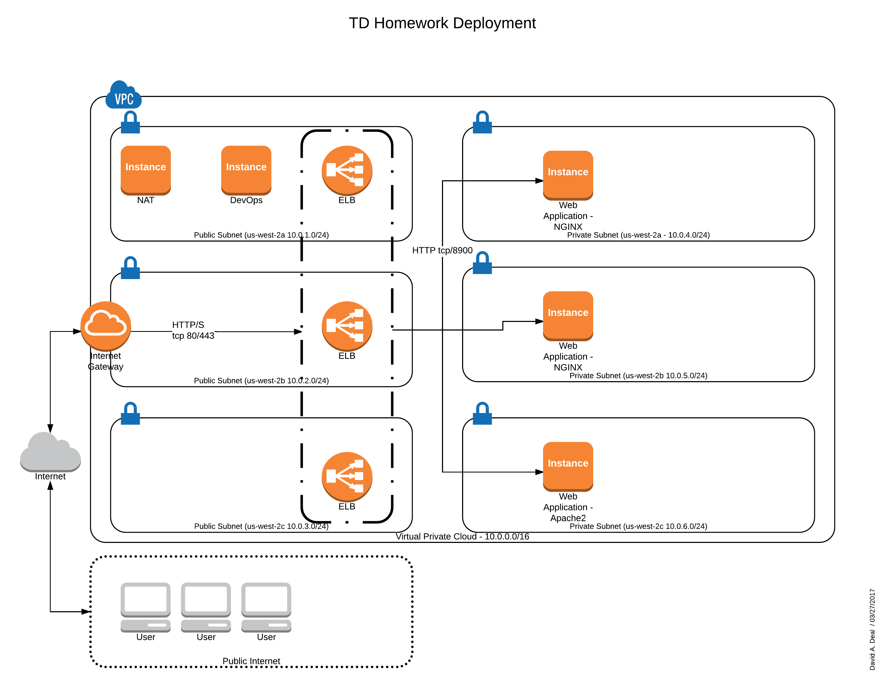

# TD Homework Project 

This project contains an Amazon Web Service CloudFormation template and support scripts to provision and deploy
a set of web servers behind an Elastic Load Balancer.  The deployment leverages Amazon's Virtual Private Cloud.

To access the infrastructure, you must first log into the DevOps workstation which is included with the provisioning.

The below diagram illustrates the deployment.



The create and manage the CloudFormation stack, a set of helper scripts (examples) are provided for command line use.
 
| Script Name | Purpose |
|:------------|:--------|
| `create-stack.sh` | Creates the CloudFormation stack in AWS |
| `delete-stack.sh` | Deletes the CloudFormation stack in AWS |
| `get-stack-status.sh` | Provides some diagnostic output and status information about a given CloudFormation stack in AWS |
| `list-stacks.sh` | Returns a list of CloudFormation stacks under your account in AWS |

# Prerequisites

- Must have an account in AWS with AWS Access Key and AWS Secret Access Key
- Must have the [AWS command line tools](https://aws.amazon.com/cli/) installed and configured (`~/.aws/config` and `~/.aws/credentials`)
- Must have a SSH key created or registered with AWS

# Notes

This CloudFormation template is designed to deploy in the US West 2 region.  The web servers and NAT router are not accessible
via SSH port 22 unless you first jump to the DevOps box.

# TODO

- Configure NGINX to run as non-root user
- Configure Apache2 to run as non-root user
- Configure ELB to listen TLS over port 443 - CloudFormation needs SSL setup details to bind to HTTPS

# Testing

To validate the deployment, review the CloudFormation output for the ELB host.  Open the ELB host link in a web browser.

Alternatively, log into the DevOps box and run the following (for example):

```bash
ubuntu@ip-10-0-0-243:~$ for i in `seq 1 100`; do curl -s http://internal-ElasticLoadBalancer-2120497040.us-west-2.elb.amazonaws.com | grep Hello; sleep 1; done
  <h1>Hello! NGINX is Running on Web 2</h1>
  <h1>Hello! NGINX is Running on Web 2</h1>
  <h1>Hello! NGINX is Running on Web 2</h1>
  <h1>Hello! NGINX is Running on Web 2</h1>
  <h1>Hello! Apache2 is Running on Web 3</h1>
  <h1>Hello! Apache2 is Running on Web 3</h1>
  <h1>Hello! Apache2 is Running on Web 3</h1>
  <h1>Hello! NGINX is Running on Web 1</h1>
  <h1>Hello! Apache2 is Running on Web 3</h1>
  <h1>Hello! NGINX is Running on Web 1</h1>
  <h1>Hello! NGINX is Running on Web 2</h1>
  <h1>Hello! NGINX is Running on Web 1</h1>
  <h1>Hello! Apache2 is Running on Web 3</h1>
  <h1>Hello! Apache2 is Running on Web 3</h1>
  <h1>Hello! NGINX is Running on Web 1</h1>
  <h1>Hello! NGINX is Running on Web 1</h1>
  <h1>Hello! Apache2 is Running on Web 3</h1>
^C
```